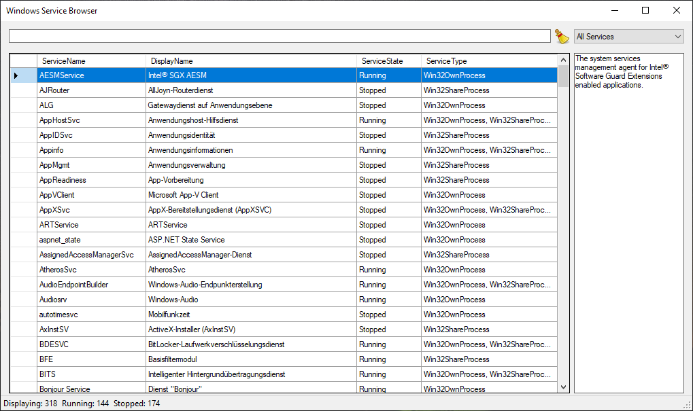
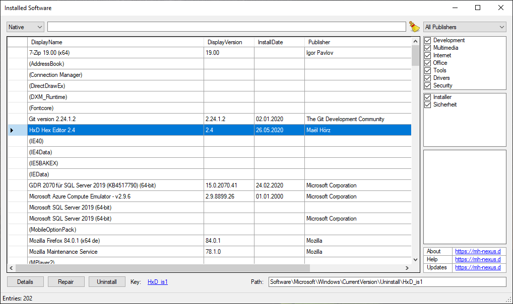
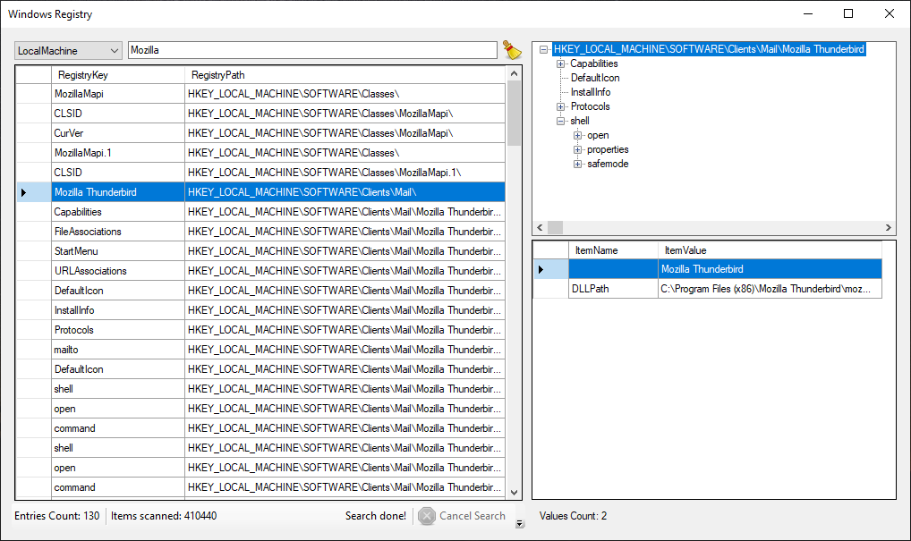
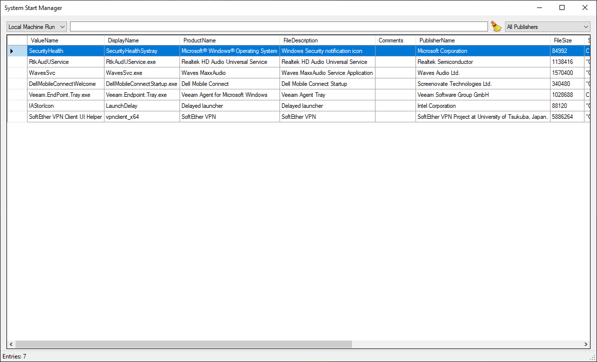
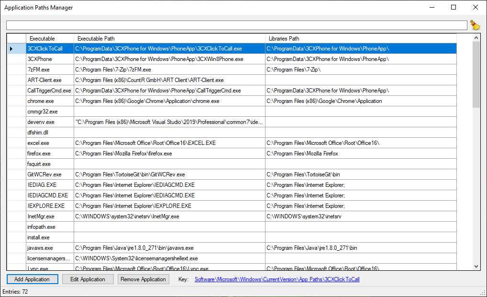
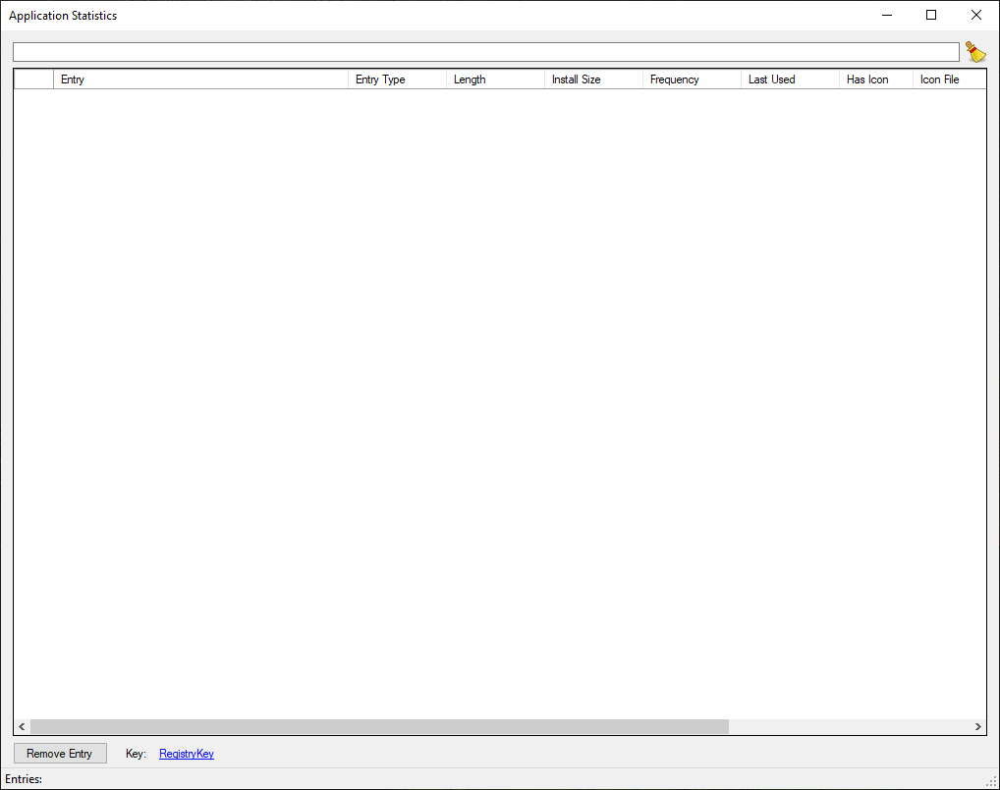

# Impellent Developer Tools

A collection of tools I developed to surpass the functionality 
provided by the system tools in Windows XP or just to test some 
.NET Framework APIs.
Most programs just add the ability to filter data easily. This 
has been provided by newer versions of Windows out-of-the-box 
though.

  - [Windows Service Browser] - list and filter Windows services
  - [Installed Software Browser] - list and filter installed software
  - [Windows Registry Browser] - easily search the Windows Registry 
  - [System Start Manager] - list entries from Windows auto-start settings
  - [Application Paths Manager] - list entries from Windows app path settings
  - [Application Statistics Manager] - list entries from Windows XP app statistics

[Windows Service Browser]: #windows-service-browser
[Installed Software Browser]: #installed-software-browser
[Windows Registry Browser]: #windows-registry-browser
[System Start Manager]: #system-start-manager
[Application Paths Manager]: #application-paths-manager
[Application Statistics Manager]: #application-statistics-manager

## Windows Service Browser

## Installed Software Browser

## Windows Registry Browser

## System Start Manager

## Application Paths Manager

## Application Statistics Manager
